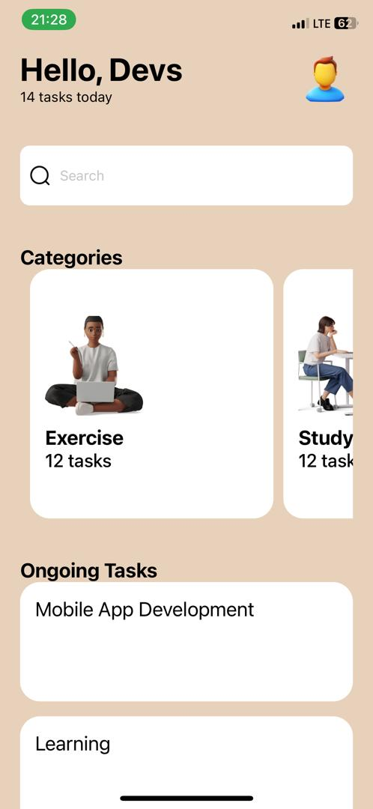

# rn-assignment3-11356915
The Task Manager App is a React Native project designed to help users manage daily tasks effectively. By categorizing tasks and displaying ongoing activities, the app offers a user-friendly and intuitive interface. This essay will detail the app's features, installation and usage, code structure, and customization options.

The app's core features include categorizing tasks, displaying ongoing tasks, and providing search functionality. Users can view tasks under categories like Exercise, Study, Relax, Walk, Read, and Swim. Each category card shows the number of tasks it contains, offering a quick overview. The ongoing tasks section lists current tasks, helping users keep track of their progress. Additionally, the search bar allows users to find specific tasks quickly, enhancing task management efficiency.

To install and run the Task Manager App, clone the repository from GitHub, navigate to the project directory, and install the dependencies using npm install. The app can be run on an Android or iOS simulator or a physical device by executing npm start, following the terminal's instructions to open the app on the chosen platform.

The project's file structure is organized for clarity. The main component, App.js, sets up the user interface and functionality. The assets directory contains images and icons, while the styles directory houses the stylesheet, ensuring a consistent look. This structure makes it easy for developers to navigate and understand the codebase.

In App.js, the code balances functionality and readability. Necessary components and hooks from react, react-native, and expo-status-bar are imported. useState manages the search text's state. ScrollView ensures the entire view is scrollable, enhancing user experience. The layout includes sections for the Header, Search Bar, Categories, and Ongoing Tasks. FlatList renders categories horizontally, while SectionList displays ongoing tasks vertically, simplifying the app's structure.

Styling is crucial for the app's intuitive interface. Using StyleSheet.create, key styles such as container, headerRow, searchBar, categoryContainer, and ongoingTaskContainer are defined. Each style ensures consistency and visual appeal. For instance, container sets the background color and padding, while headerRow aligns the greeting and profile image. The searchBar style provides padding and background color, aligning components for a clean look. Category and ongoing task containers are styled for readability and user interaction.

Customization is a significant advantage of the Task Manager App. Users can modify data in the data and ONGOING_TASKS arrays, change images in the assets/images directory, and update styles in StyleSheet.create to personalize the app's appearance.

Contributing to the app is straightforward. Developers can fork the repository, create a new branch, make and commit changes, push to the branch, and open a pull request. This collaborative approach encourages community involvement and continuous improvement.

In summary, the Task Manager App is a versatile and user-friendly tool for managing daily tasks. Its organized structure, clear code, and intuitive design make it an excellent choice for users and developers. With easy installation, extensive customization options, and a collaborative contribution process, the Task Manager App is a valuable productivity tool.

